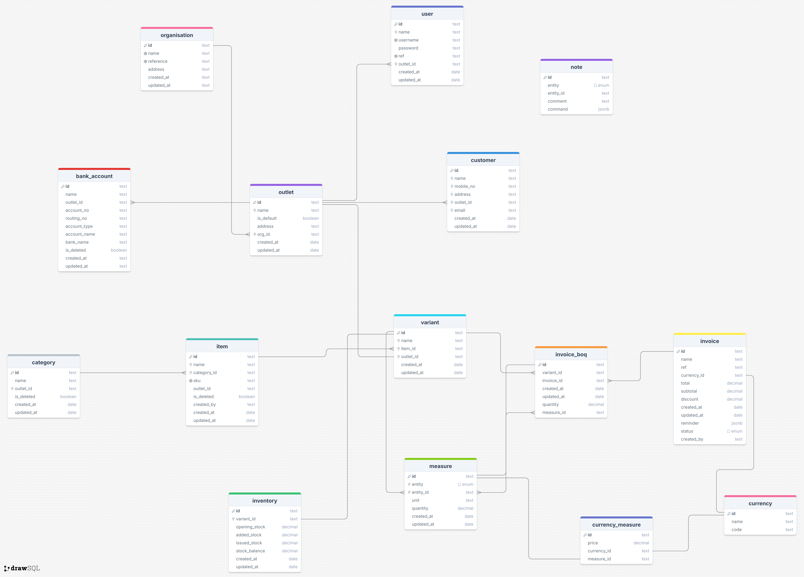

# Invoice Book

## Description

Invoice Book is a simple API for managing invoices, items, and inventories. It is built with Go and Gin. It uses PostgreSQL as the database and SQLx as the builder.

### Postman Collection
[Documentation](https://documenter.getpostman.com/view/9582699/2sAXjRW9X3)

### Libraries
* [APD](https://github.com/cockroachdb/apd)
* [CORS](https://github.com/gin-contrib/cors)
* [Gin](https://github.com/gin-gonic/gin)
* [Validator](https://github.com/go-playground/validator)
* [Gomigrate](https://github.com/golang-migrate/migrate)
* [SQLx](github.com/jmoiron/sqlx)
* [DOTEnv](github.com/joho/godotenv)
* [PQ](github.com/lib/pq)
* [Ksuid](github.com/segmentio/ksuid)
* [Zap](go.uber.org/zap)

### List of Features
* Organization
  * Create an organization
  * List organizations
  * Get an organization
* Outlet  (Organization)
  * Create an outlet
  * List outlets
  * Get an outlet
* User (Outlet)
  * Create a user
  * List users
  * Get a user
* Bank Account (Outlet)
  * Create an outlet bank account
  * List outlet bank accounts
  * Get an outlet bank account
* Currency 
    * Create a currency
    * List currencies
    * Get a currency
* Category (Outlet)
    * Create a category
    * List categories
    * Get a category
* Item
    * Create an item
    * List items
    * Get an item
* Variant (Item)
    * Create a variant
    * Measure a variant + Currency
    * List variants
    * Get a variant
* Invoice (Outlet)
    * Create an invoice and bill of quantity
    * List invoices
    * Get an invoice
* Note (Activity)
    * Create a note
    * List notes
    * Get a note
* Inventory (Outlet | Variant)
    * Create an inventory
    * List inventories
    * Get an inventory

## Assumptions

- Organization can have multiple outlets
- Outlet can have multiple users
- Outlet can have multiple bank accounts
- Outlet can have multiple categories
- Item can have multiple variants
- Invoice can have multiple boq
- Invoice set a default currency
- Invoice actions have multiple notes(activities)
- Inventory can have multiple variants


## Plans for Improvement

- [ ] Add a feature to update all modules
- [ ] Add a feature to delete all modules
 

## Installation
```bash
go get 
```
```bash
go run .
```

## Usage
```bash
curl -X POST http://localhost:8080/api/v1/organizations -d '{"name":"Organization 1"}'
```

## Entity Diagram
